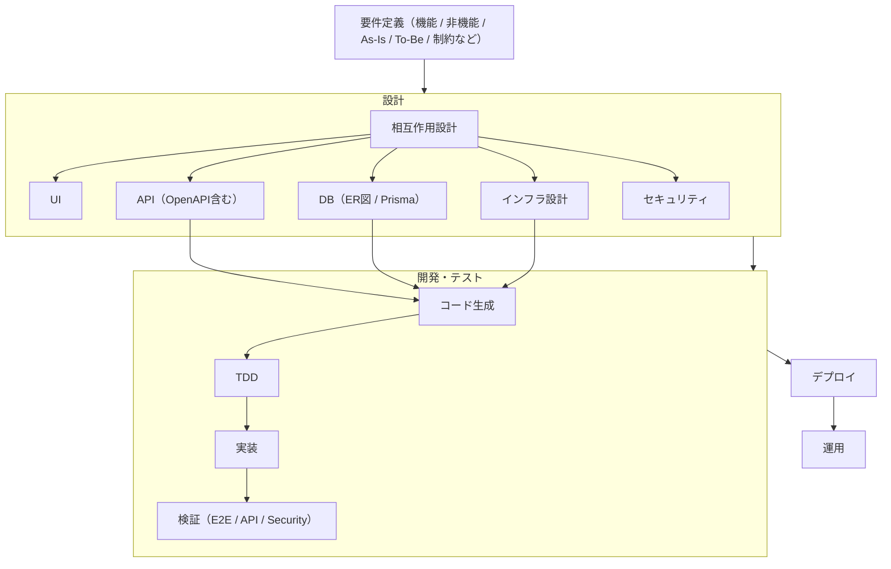

# AGENTS.md

## 概要

本システムは、画像アップロード機能を中心としたSPA構成とし、
モノレポ構成を採用する。

## 目的

すべての実装は **specs を唯一の真実（Single Source of Truth）** とし、そこから導出される。

## ディレクトリ構成

```txt
repo/
├── specs/hugo/content
│   └── requirements/             # ビジネス要件・非機能要件 (req-*)
│   └── common/                   # 全体構造・設計思想
│   ├── interaction/              # 相互作用設計（シーケンス図等）
│   ├── api/                      # API設計書 (api-*)
│   ├── ui/                       # UI/UX・画面遷移・ワイヤーフレーム
│   ├── db/                       # DB設計・ER図
│   └── infra/                    # インフラ詳細設計
├── docs/
│   └── ADR/                      # 意思決定記録
├── apps/
│   ├── frontend/                 # React SPA（UI層：ユーザー体験の実装）
│   │   ├── src/
│   │   └── tests/                # UI単体テスト（Vitest / Testing Library）
│   └── backend/                  # Hono（Interface層：APIエンドポイント）
│       ├── src/
│       └── tests/                # API単体テスト（ルーティング / ミドルウェア）
├── packages/
│   ├── api/                      # API Client（Orvalによる型・Client生成）
│   ├── db/                       # DBアクセス層（Prisma / Repository）
│   ├── domain/                   # ドメイン層（ビジネスロジックの中核）
│   ├── infra/                    # IaC（Terraform）
│   ├── ui/                       # 共通UI（shadcn/uiベース）
│   └── shared/                   # 横断的関心事（trace_id / logger / config）
├── tests/                        # 横断的テスト（仕様検証）
│   ├── api/                      # APIテスト（OpenAPI準拠）
│   ├── e2e/                      # ユースケーステスト
│   └── security/                 # 攻撃再現テスト
└── AGENTS.md                     # AI開発ルール
```

## 技術構成

### 開発基盤

- **Tool Manager**: mise
- **Monorepo**: pnpm Catalogs + Turborepo
- **Lint/Formatter**: Biome
- **CI/CD**: GitHub Actions
- **TypeScript**: JSDoc によるドキュメント記述（全パッケージ共通）
- **Validation**: Zod（全パッケージ共通）

### フロントエンド

- **Framework**: React
- **Router**: React Router（Loader / Action によるデータフェッチ・ミューテーション）
- **Architecture**: Feature-Sliced Design（FSD）
- **UI**: shadcn/ui
- **State Management**: TanStack Query
- **API Client**: Orval (OpenAPIから自動生成)

### バックエンド

- **Runtime**: Bun
- **Framework**: Hono
- **Logging**: Pino
- **Middleware**: trace_id, request_id, レート制限, CORS, エラーハンドリング

### ドメイン・DB・インフラ

- **Architecture**: DDD Lite（戦術パターン：Entity / Value Object / Repository / Domain Service）
- **DB**: PostgreSQL / Prisma
- **Infrastructure**: AWS (S3, CloudFront, Lambda) / Terraform

### テスト

- **Unit Test**: Vitest
- **API Test**: REST Client
- **E2E Test**: Playwright

## コア原則

### 1. Specs First

いかなる設計・実装よりも先に、`specs/` で「期待される振る舞い」を定義する。
**「仕様（What）が未定義の設計（How）」および「設計が未定義の実装」を禁止する。**

### 2. Single Source of Truth

`specs/` はシステムの挙動における唯一の真実である。
最終的な成果物（コード）は、`specs/` で定義された振る舞いを完全に満たさなければならない。

### 3. ID・ファイル命名規則

原則として、ドメインに紐づく機能仕様は以下のID命名規則（`{layer}{nnn}-{domain}-{action}`）に従い、`{ID}.md` 形式で管理する。
ただし、システム全体に横断的に関わる設計（全体アーキテクチャ、ER図、セキュリティ基本方針など）については、この規則の例外とし、内容を端的に表す名称を許容する。

- **Layer 例 (ドメイン単位)**: `api` (OpenAPI), `req` (Requirement)
- **Layer 例 (全体・共通)**: アーキテクチャ, ER図
- **命名例（ドメイン）**：`req001-upload`, `api001-upload-create`
- **命名例（全体・共通）**：`ER図`, `システム構成図`

### 4. Traceability（トレーサビリティ）

すべての設計ドキュメント、実装、テストコードは、起点となる Spec ID（`req*`）および Design ID（`api*`, `infra*`）と相互に紐付かなければならない。

### 5. 関心の分離

- **frontend**: UI/UXの構築
- **backend**: ルーティングとミドルウェア
- **domain**: ビジネスロジックとセキュリティポリシーの強制
- **infra**: 環境構築とリソース管理

### 6. Security First

セキュリティは後付け禁止。domain/policy で強制する。

### 7. 多層防御 (Defense in Depth)

フロント、API、ストレージ、非同期処理の各層で防御を実装する。

### 8. 言語規約 (Language Rule)

**原則として日本語**で記述する

## 開発フロー



## 開発規約

### ブランチ戦略 (GitHub Flow)

- **mainブランチ**: 常にデプロイ可能な状態を維持する。
- **トピックブランチ**: `main`からブランチを作成し、機能開発やバグ修正を行う。
  - 命名規則: `feature/issue-id`, `fix/issue-id`, `docs/issue-id` など。

### コミットメッセージ規約 (Conventional Commits)

以下の形式を採用する：
`<type>(<scope>): <subject>`

- **type**:
  - `feat`: 新機能の開発
  - `fix`: バグの修正
  - `docs`: ドキュメントの変更
  - `style`: コードの動作に影響しないフォーマット等の変更
  - `refactor`: リファクタリング
  - `perf`: パフォーマンスの改善
  - `test`: テストの追加・修正
  - `chore`: ビルドプロセスやライブラリの更新など
- **scope**: 変更範囲（例: `frontend`, `backend`, `domain`, `specs` など。任意）
- **subject**: 変更内容の簡潔な要約（原則日本語）

## テスト戦略

### 優先順位

1. **Domainテスト**（最重要：ロジックとポリシー）
2. **APIテスト**（契約適合性）
3. **E2Eテスト**（ユースケース通し）
4. **セキュリティテスト**

### 原則

- テストは仕様 (specs) に基づき、ID単位で記述する。
- 例: `test('uc-upload-001 正常系')`

## セキュリティルール

- **バイナリ検証**: MIMEタイプをマジックナンバーベースで検証
- **制限**: ファイルサイズ、拡張子、レート制限の徹底
- **認可**: Presigned URL の有効期限制御
- **追跡**: request_id による冪等性、trace_id によるトレーサビリティ

## ロギング・観測性

- trace_id は Frontend で生成（UUID v4）し、全リクエストのヘッダー `X-Trace-ID` に付与する。
- Backend middleware で受け取り、全レイヤのログに引き継ぐ。
- ログは Pino で構造化（JSON）出力し、CloudWatch Logs に集約する。
- 障害調査は CloudWatch Logs Insights で trace_id をキーに横断検索する。
- DBへのログ保存は行わない。

## アンチパターン

- specs を更新せずにコードを変更する。
- docs に真実としての仕様を記述する。
- domain を通さずに DB 操作（Prisma直接使用等）を行う。
- フロントエンドに複雑なビジネスロジックを実装する。

## 完了の定義

- specs が存在し、ID で全レイヤ（要件〜テスト）が紐づいている。
- テストがパスし、定義されたセキュリティ要件を満たしている。
- trace_id によりバックエンドからログまで追跡可能である。

## 哲学

コードを書くな、仕様を書け。仕様からコードを生み出せ。
