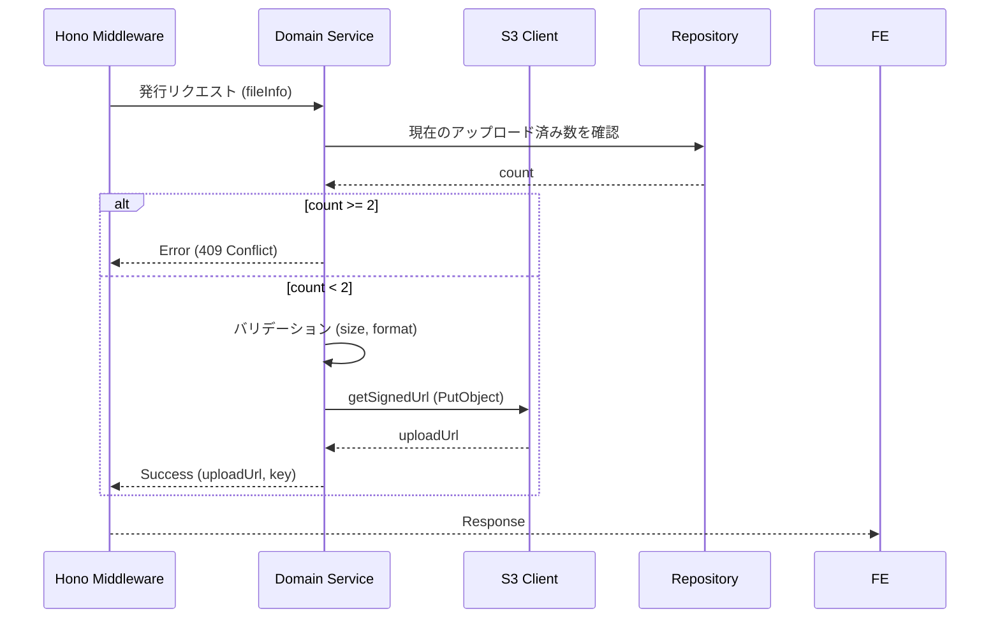

# Presigned URL 発行

## ID

api001-upload

## エンドポイント

| メソッド | パス |
|:---|:---|
| POST | `/api/v1/images/presigned-url` |

## 概要

S3アップロード用の署名付きURLを発行する。

## リクエスト

### ヘッダー

| ヘッダー名 | 必須 | 説明 |
|:---|:---:|:---|
| X-Trace-ID | ✓ | トレーサビリティID（UUID v4） |

### ボディ

```json
{
  "fileName": "string",
  "fileSize": "number",
  "contentType": "string"
}
```

## バリデーション

| 検証項目 | 条件 | レスポンス |
|:---|:---|:---|
| ファイルサイズ | 5MB 超 | `400 Bad Request` |
| Content-Type | 許可リスト外 | `400 Bad Request` |
| アップロード枚数上限 | 同一ユーザーが 2 枚以上保持 | `409 Conflict` |
| レート制限 | 同一 IP から 1 分間に 10 回超 | `429 Too Many Requests` |

許可 Content-Type: `image/jpeg` `image/png` `image/gif` `image/webp`

## Presigned URL 有効期限

発行から **300 秒（5 分）** 以内に PUT が完了しない場合 URL は無効となる。期限切れ時はクライアントが発行から再試行する。

## レスポンス

### 200 OK

```json
{
  "uploadUrl": "string",
  "key": "string"
}
```

### ステータスコード

| コード | 説明 |
|:---|:---|
| 200 | 成功 |
| 400 | バリデーションエラー（サイズ超過・形式不備） |
| 409 | アップロード枚数上限超過 |
| 429 | レート制限超過 |
| 500 | サーバーエラー |

## 内部処理シーケンス


