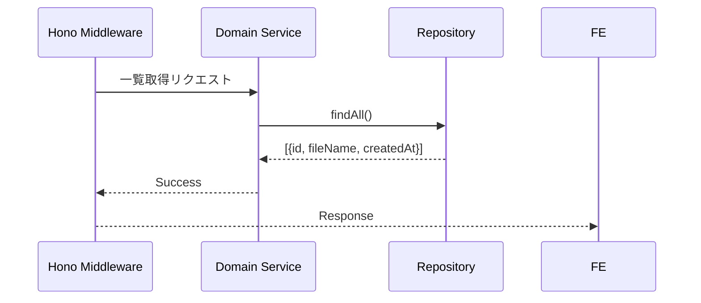

# 画像一覧取得

## ID

api003-upload

## エンドポイント

| メソッド | パス |
|:---|:---|
| GET | `/api/v1/images` |

## 概要

アップロード済み画像のメタデータ一覧（ID・ファイル名）を取得する。画像の実体（バイナリ・閲覧用URL）はここでは取得しない。ユーザーがリストから画像を選択した時点で api004-upload により個別取得する。

## リクエスト

### ヘッダー

| ヘッダー名 | 必須 | 説明 |
|:---|:---:|:---|
| X-Trace-ID | ✓ | トレーサビリティID（UUID v4） |

### クエリパラメータ

なし

## レスポンス

### 200 OK

```json
[
  {
    "id": "string",
    "fileName": "string",
    "createdAt": "iso-8601"
  }
]
```

### ステータスコード

| コード | 説明 |
|:---|:---|
| 200 | 成功（0件の場合は空配列） |
| 500 | サーバーエラー |

## 内部処理シーケンス


