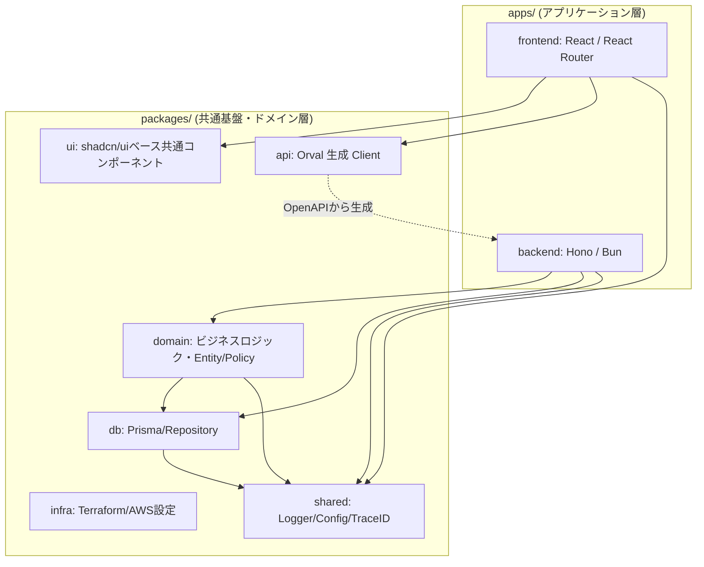

# アーキテクチャ図

## 概要

本システムの全体構造、モノレポ内の各パッケージの責務、およびそれらの依存関係を定義する。
本システムはモノレポ構成を採用し、関心の分離（SoC）を徹底する。

## レイヤー構造図

## 各パッケージの責務

- **apps/frontend**: UI/UXの構築。React Routerによるルーティング、TanStack Queryによる状態管理。
- **apps/backend**: HonoによるAPIエンドポイント。ミドルウェア（CORS, Logger, TraceID）の適用。
- **packages/domain**: ビジネスロジックの中核。Entity, Value Object, Domain Service, およびポリシーの強制。
- **packages/db**: データアクセス層。Prisma Clientを用いたデータベース操作、Repositoryパターン。
- **packages/ui**: デザインシステムに基づく共通UIコンポーネント群。
- **packages/api**: OpenAPI (specs/api) から生成されたフロントエンド用APIクライアント。
- **packages/infra**: TerraformによるAWSリソース（S3, CloudFront, Lambda等）のコード化。
- **packages/shared**: trace_id (UUID v4)、Pinoによる構造化ロガー、共通設定等の横断的関心事。
