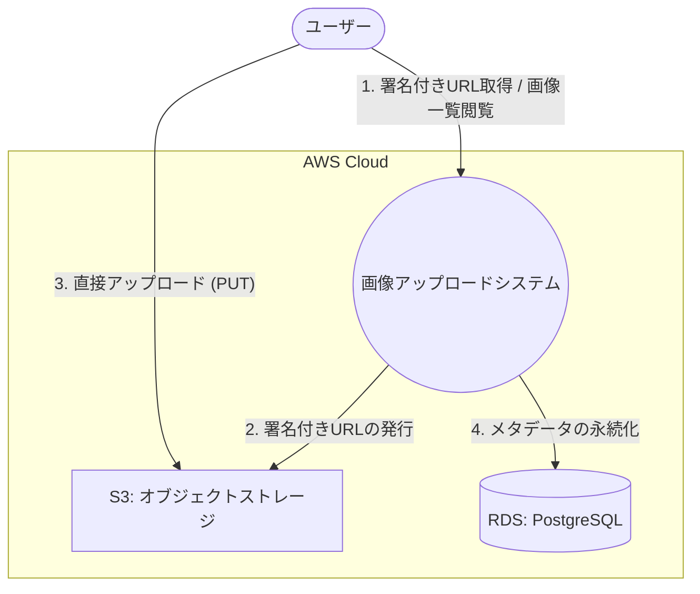

# コンテキストマップ

## 概要

本システムの境界と、外部アクター、外部システムとの関係を定義する。

## コンテキスト図

## 境界の定義

### システム境界 (System Boundary)
- **Frontend (React)**: ユーザーインターフェース、プレビュー表示、S3への直接アップロード。
- **Backend (Hono)**: 署名付きURLの発行、バリデーション、DB操作の仲介。
- **Domain**: ビジネスロジック、セキュリティポリシーの適用。

### 外部エンティティ (External Entities)
- **ユーザー**: システムを利用して画像をアップロードし、閲覧するエンドユーザー。
- **AWS S3**: 画像ファイルの実体を保存するオブジェクトストレージ。
- **PostgreSQL**: 画像のメタデータ（ファイル名、パス、サイズ、アップロード日時等）を保存するリレーショナルデータベース。
