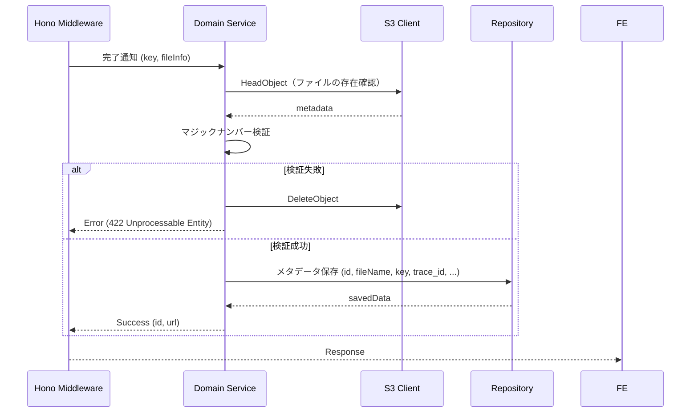

# アップロード完了・メタデータ登録

## ID

api002-upload

## エンドポイント

| メソッド | パス |
|:---|:---|
| POST | `/api/v1/images/complete` |

## 概要

S3への直接アップロード完了後、マジックナンバー検証を行いメタデータをDBに登録する。

## リクエスト

### ヘッダー

| ヘッダー名 | 必須 | 説明 |
|:---|:---:|:---|
| X-Trace-ID | ✓ | トレーサビリティID（UUID v4） |

### ボディ

```json
{
  "key": "string",
  "fileName": "string",
  "fileSize": "number",
  "contentType": "string"
}
```

## バリデーション（マジックナンバー検証）

S3上のファイルの先頭バイト列を読み取り、実際のMIMEタイプを検証する。拡張子・Content-Typeヘッダーのみへの依存を禁止する。

| フォーマット | マジックナンバー |
|:---|:---|
| JPEG | `FF D8 FF` |
| PNG | `89 50 4E 47 0D 0A 1A 0A` |
| GIF | `47 49 46 38` |
| WebP | `52 49 46 46 ?? ?? ?? ?? 57 45 42 50` |

検証失敗時: S3上のファイルを即時削除し、DBへのメタデータ保存を行わない。

## レスポンス

### 201 Created

```json
{
  "id": "string",
  "url": "string"
}
```

### ステータスコード

| コード | 説明 |
|:---|:---|
| 201 | 成功 |
| 404 | S3上にファイルが存在しない |
| 422 | マジックナンバー検証失敗（S3ファイルを削除） |
| 500 | サーバーエラー |

## 内部処理シーケンス


