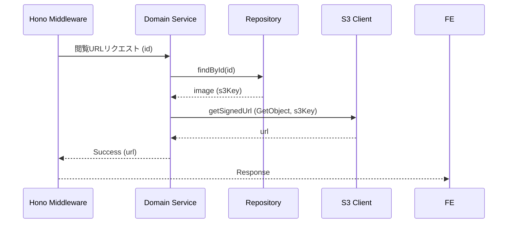

# 画像閲覧用URL取得

## ID

api004-upload

## エンドポイント

| メソッド | パス |
|:---|:---|
| GET | `/api/v1/images/:id` |

## 概要

指定した画像IDに対応する閲覧用Presigned URLを取得する。

## リクエスト

### ヘッダー

| ヘッダー名 | 必須 | 説明 |
|:---|:---:|:---|
| X-Trace-ID | ✓ | トレーサビリティID（UUID v4） |

### パスパラメータ

| パラメータ名 | 型 | 説明 |
|:---|:---|:---|
| id | string (UUID) | 画像ID |

## レスポンス

### 200 OK

```json
{
  "url": "string"
}
```

### ステータスコード

| コード | 説明 |
|:---|:---|
| 200 | 成功 |
| 404 | 指定IDの画像が存在しない |
| 500 | サーバーエラー |

## 内部処理シーケンス


