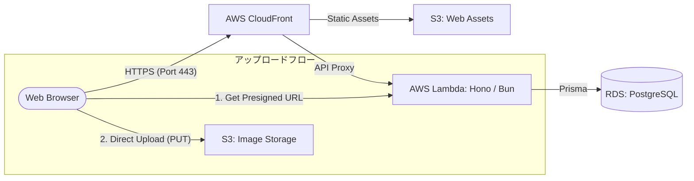

# システム構成図

## 概要

本システムのデプロイメント環境および AWS インフラストラクチャの構成を定義する。

## インフラ構成図

## 使用サービスと役割

- **AWS CloudFront**: コンテンツ配信ネットワーク (CDN)。静的アセットのキャッシュおよびAPIアクセスのプロキシ。
- **AWS S3 (Static Web Hosting)**: React でビルドされたフロントエンドアセットのホスティング。
- **AWS S3 (Object Storage)**: アップロードされた画像ファイルの実体を保存。Presigned URL 方式により、バックエンドを介さずセキュアに直接アップロードを行う。
- **AWS Lambda / Hono (Bun)**: サーバーレスコンピューティングによるバックエンドAPIの実行。
- **Amazon RDS (PostgreSQL)**: マネージドデータベース。Prisma を介して画像のメタデータ等を永続化する。

## ネットワーク・セキュリティ

- **HTTPS**: 全通信は SSL/TLS で暗号化される。
- **CORS**: S3 バケットの設定により、特定のオリジンからの Direct Upload のみを許可する。
- **VPC (Virtual Private Cloud)**: RDS 等のバックエンドリソースはプライベートサブネット内に配置し、不必要な外部露出を避ける（Terraform にて定義）。
