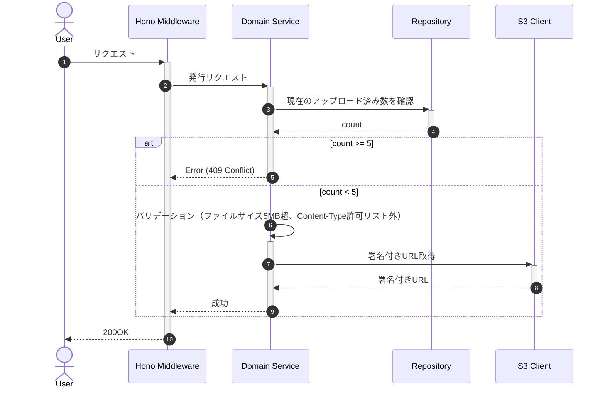

# 署名付きURL 発行

## ID

api001-upload

## エンドポイント

| メソッド | パス |
|:---|:---|
| POST | `/images/presigned-url` |

## 概要

S3アップロード用の署名付きURLを発行する。

## リクエスト

### ボディ

| 物理名 | 論理名 | 型 | 必須 | 説明 |
|:---|:---|:---|:---:|:---|
| fileName | ファイル名 | string | ✓ | アップロードするファイル名 |
| fileSize | ファイルサイズ | number | ✓ | ファイルサイズ（バイト単位） |
| contentType | Content-Type | string | ✓ | MIMEタイプ |

```json
{
  "fileName": "string",
  "fileSize": "number",
  "contentType": "string"
}
```

## バリデーション

| 検証項目 | 条件 | レスポンス | メッセージ | 備考 |
|:---|:---|:---|:---|:---|
| ファイルサイズ | 5MB 超 | `400 Bad Request` | MSG-API-001 | |
| Content-Type | 許可リスト外 | `400 Bad Request` | MSG-API-002 | 許可 Content-Type: `image/jpeg` `image/png` `image/gif` `image/webp` |
| アップロード枚数上限 | 同一ユーザーが 5 枚以上保持 | `409 Conflict` | MSG-API-003 |  |
| レート制限 | 同一 IP から 1 分間に 10 回超 | `429 Too Many Requests` | MSG-API-C001 | 共通仕様に準拠 |

## Presigned URL 有効期限

発行から **300 秒（5 分）** 以内に PUT が完了しない場合 URL は無効となる。期限切れ時はクライアントが発行から再試行する。

## レスポンス

### 200 OK

| 物理名 | 論理名 | 型 | 必須 | 説明 |
|:---|:---|:---|:---:|:---|
| uploadUrl | アップロードURL | string | ✓ | S3への署名付きURL |
| key | オブジェクトキー | string | ✓ | S3オブジェクトのキー |

```json
{
  "uploadUrl": "string",
  "key": "string"
}
```

### ステータスコード

| コード |  説明 |
|:---|:---|
| 200  | 成功 |
| 400  | バリデーションエラー（サイズ超過・形式不備） |
| 409  | アップロード枚数上限超過 |
| 429  | レート制限超過 |

## 内部処理シーケンス



## 懸案事項

### ユーザーごとの絞り込み
- **現状**: DBクエリにユーザーID条件が含まれていない
- **影響**: 全ユーザーの画像が混在して表示・管理される
- **対応方針**: 認証機構と連携し、ログインユーザーの画像のみに絞り込む

### 画像の削除機能
- **現状**: 削除用APIが未定義
- **影響**: ユーザーが不要な画像を削除できない
- **対応方針**: 削除用API（api005-delete）を新規設計する

## TBD

### 画像管理機能拡張
- 画像のメタデータ拡張（タグ、説明文など）
- 画像の公開・非公開設定

### パフォーマンス最適化
- S3署名付きURLのキャッシュ戦略
