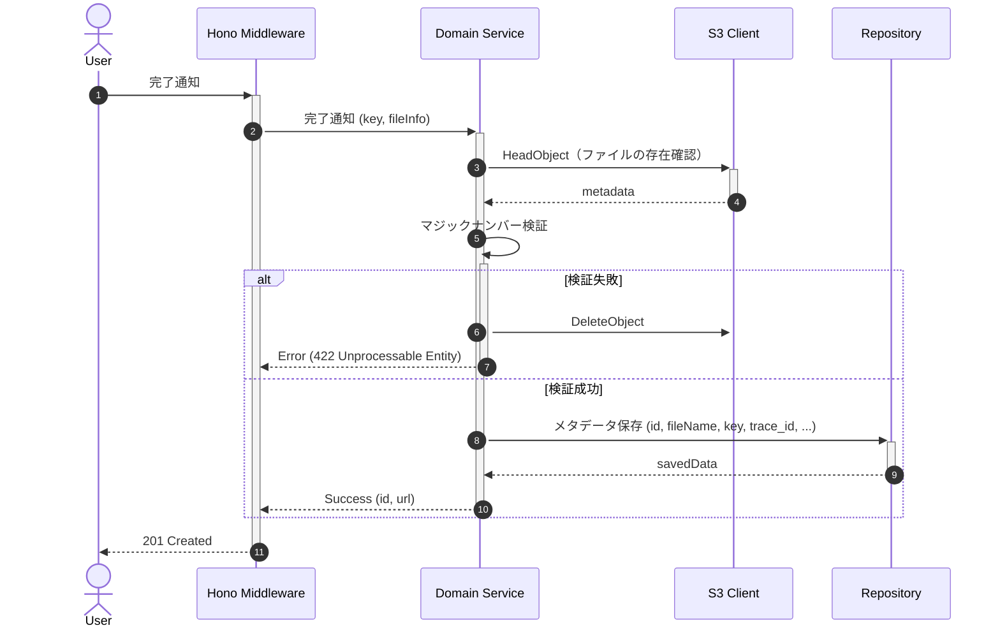

# アップロード完了・メタデータ登録

## ID

api002-upload

## エンドポイント

| メソッド | パス |
|:---|:---|
| POST | `/images` |

## 概要

S3への直接アップロード完了後、マジックナンバー検証を行いメタデータをDBに登録する。

## リクエスト

### ボディ

| 物理名 | 論理名 | 型 | 必須 | 説明 |
|:---|:---|:---|:---:|:---|
| key | S3オブジェクトキー | string | ✓ | S3上の保存パス |
| fileName | ファイル名 | string | ✓ | アップロードしたファイル名 |
| fileSize | ファイルサイズ | number | ✓ | ファイルサイズ（バイト単位） |
| contentType | Content-Type | string | ✓ | MIMEタイプ |

```json
{
  "key": "string",
  "fileName": "string",
  "fileSize": "number",
  "contentType": "string"
}
```

## バリデーション

| 検証項目 | 条件 | レスポンス | メッセージ | 備考 |
|:---|:---|:---|:---|:---|
| S3ファイル存在 | ファイルが存在しない | `404 Not Found` | MSG-API-005 | |
| マジックナンバー | 許可フォーマット外 | `422 Unprocessable Entity` | MSG-API-004 | S3ファイルを削除 |

### マジックナンバー検証

S3上のファイルの先頭バイト列を読み取り、実際のMIMEタイプを検証する。拡張子・Content-Typeヘッダーのみへの依存を禁止する。

| フォーマット | マジックナンバー |
|:---|:---|
| JPEG | `FF D8 FF` |
| PNG | `89 50 4E 47 0D 0A 1A 0A` |
| GIF | `47 49 46 38` |
| WebP | `52 49 46 46 ?? ?? ?? ?? 57 45 42 50` |

## レスポンス

### 201 Created

| 物理名 | 論理名 | 型 | 必須 | 説明 |
|:---|:---|:---|:---:|:---|
| id | 画像ID | string | ✓ | 登録された画像のID |
| url | 閲覧用URL | string | ✓ | 画像の閲覧用URL |

```json
{
  "id": "string",
  "url": "string"
}
```

### ステータスコード

| コード | 説明 |
|:---|:---|
| 201 | 成功 |
| 404 | S3上にファイルが存在しない |
| 422 | マジックナンバー検証失敗（S3ファイルを削除） |

## 内部処理シーケンス



## 懸案事項

### データの整合性

- **現状**: フロントエンドがS3にファイルをアップロードした後、バックエンドの検証に失敗した場合、S3には実態があるが、DBにはレコードがない。
- **影響**: データの不整合
- **対応方針**: ①S3イベント通知を利用した自動登録（S3のObjectCreatedイベントを監視して、DBにレコードを自動登録） ②クリーンアップバッチの導入（DBにレコードがないS3ファイルを定期的に削除）

### トランザクション処理の未確定
- **現状**: S3削除とDBロールバックの連携が未定義
- **影響**: マジックナンバー検証失敗時にS3ファイルのみ削除され、不整合状態が発生する可能性
- **対応方針**: トランザクション処理または補償トランザクションの導入

### メタデータ登録の原子性
- **現状**: S3検証とDB登録が分離している
- **影響**: DB登録失敗時にS3ファイルが残り続ける
- **対応方針**: 登録処理全体の原子性保証

## TBD

### 画像処理機能拡張
- 画像のリサイズ・サムネイル生成
- 画像の最適化（圧縮）処理
- EXIF情報の抽出と保存

### 非同期処理の導入
- マジックナンバー検証のバックグラウンド処理化
- 重い画像処理のキューイング
- 処理状況の進捗管理
