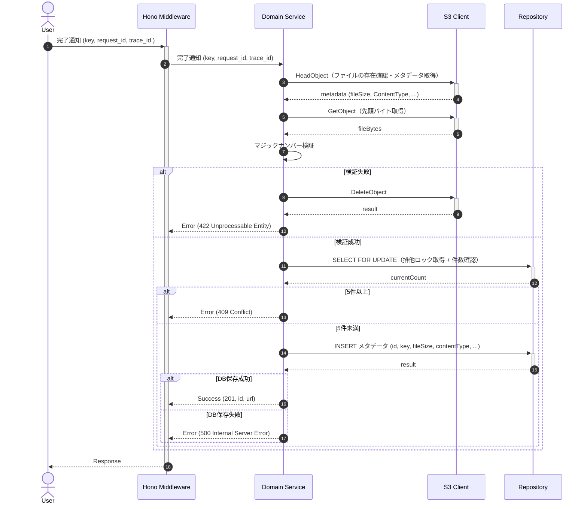

# アップロード完了・メタデータ登録

## ID

api002-upload

## エンドポイント

| メソッド | パス      |
| :------- | :-------- |
| POST     | `/images` |

## 概要

S3への直接アップロード完了後、マジックナンバー検証を行いメタデータをDBに登録する。

## リクエスト

### ボディ

| 物理名 | 論理名             | 型     | 必須  | 説明           |
| :----- | :----------------- | :----- | :---: | :------------- |
| key    | S3オブジェクトキー | string |   ✓   | S3上の保存パス |

```json
{
  "key": "string"
}
```

## バリデーション

| 検証項目             | 条件                      | レスポンス                  | メッセージ  | 備考                                    |
| :------------------- | :------------------------ | :-------------------------- | :---------- | :-------------------------------------- |
| S3ファイル存在       | ファイルが存在しない      | `404 Not Found`             | MSG-API-005 |                                         |
| マジックナンバー     | 許可フォーマット外        | `422 Unprocessable Entity`  | MSG-API-004 | S3ファイルを削除（失敗時422）           |
| S3削除失敗           | 削除操作のエラー          | `500 Internal Server Error` | MSG-API-006 | トランザクション不整合リスク            |
| アップロード枚数上限 | 排他ロック取得後に5件以上 | `409 Conflict`              | MSG-API-003 | SELECT FOR UPDATEで競合防止後にチェック |

### マジックナンバー検証

S3上のファイルの先頭バイト列を読み取り、実際のMIMEタイプを検証する。ファイルサイズはS3 HeadObjectメタデータから取得し、クライアント送信値に依存しない。

| フォーマット | マジックナンバー                                    |
| :----------- | :-------------------------------------------------- |
| JPEG         | `FF D8 FF`                                          |
| PNG          | `89 50 4E 47 0D 0A 1A 0A`                           |
| GIF          | `47 49 46 38`                                       |
| WebP         | `52 49 46 46` (offset 0) + `57 45 42 50` (offset 8) |

## レスポンス

### 201 Created

| 物理名 | 論理名    | 型     | 必須  | 説明               |
| :----- | :-------- | :----- | :---: | :----------------- |
| id     | 画像ID    | string |   ✓   | 登録された画像のID |
| url    | 閲覧用URL | string |   ✓   | 画像の閲覧用URL    |

```json
{
  "id": "string",
  "url": "string"
}
```

### ステータスコード

| コード | 説明                                         |
| :----- | :------------------------------------------- |
| 201    | 成功                                         |
| 404    | S3上にファイルが存在しない                   |
| 409    | アップロード枚数上限超過（5件以上）          |
| 422    | マジックナンバー検証失敗（S3ファイルを削除） |
| 500    | S3削除失敗またはDB登録失敗                   |

## 内部処理シーケンス



## 懸案事項

### S3とDB間の分散トランザクション

- **現状**: 
  - フロントエンドがPresigned URLでS3に直接アップロード
  - バックエンドが独立してメタデータをDB登録
  - 2つのトランザクションはネットワーク境界を越えており、従来的なACIDトランザクションで統一できない
  - API登録失敗時にS3とDB間で不整合が発生する可能性

- **影響**: 
  - S3とDB間のデータ不整合が一時的に発生
  - 監視なしでは不整合を発見できない
  - 定期的なクリーンアップ処理が必須となり、保守負荷が増加

- **対応方針**: 
  1. **不整合検出**: API登録失敗時にステータスを記録し、監視・アラート設定
  2. **定期修復バッチ**: DBにレコードがないS3ファイルを定期的に削除（S3スキャン+クリーンアップ）
  3. **冪等性確保**: request_idの一意性により、重複登録を防止
  4. **監査ログ**: request_id・trace_idですべての操作を追跡可能にし、障害時の原因調査を容易に
  5. **イベント駆動設計（将来）**: S3 ObjectCreatedイベント → Lambda/SQS → バックエンドAPI自動呼び出しパターン。フロントが完了通知を忘れずとも、S3アップロード完了を自動検知してメタデータ登録を確実に実行。API失敗時の自動リトライ機構により、分散トランザクション問題を軽減。

## TBD

### 画像処理機能拡張
- 画像のリサイズ・サムネイル生成
- 画像の最適化（圧縮）処理
- EXIF情報の抽出と保存

### 非同期アーキテクチャへの移行（将来）
本設計は**同期的なマジックナンバー検証**を前提としています。
ファイル容量が大きい場合やレスポンス時間を短縮する必要がある場合は、以下の非同期化を検討します：
- S3 ObjectCreatedイベント → Lambda → 非同期キューでマジックナンバー検証
- 検証結果に応じてDB登録またはS3ファイル削除
- フロントエンドは即座に202 Acceptedで応答し、別ポーリングで完了通知を受け取る

ただし、非同期化時はメタデータ保存時のステータス管理（pending/completed/failed）が必須になります。
