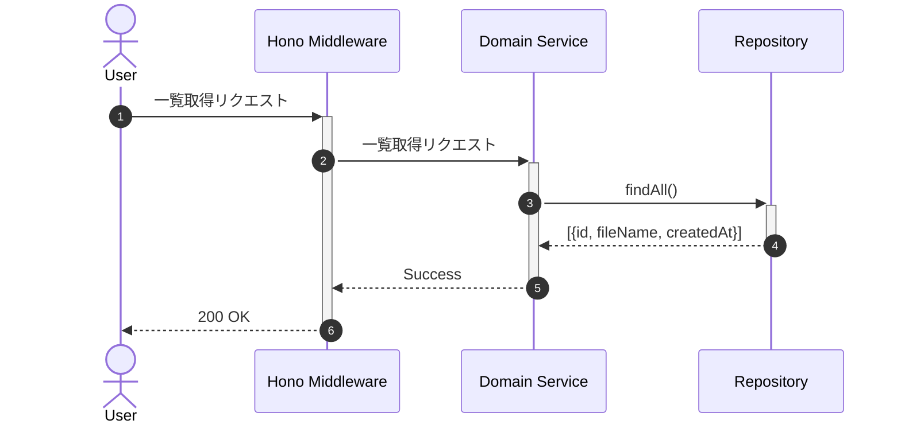

# 画像一覧取得

## ID

api003-upload

## エンドポイント

| メソッド | パス |
|:---|:---|
| GET | `/images` |

## 概要

アップロード済み画像のメタデータ一覧（ID・ファイル名）を取得する。画像の実体（バイナリ・閲覧用URL）はここでは取得しない。ユーザーがリストから画像を選択した時点で api004-upload により個別取得する。

## レスポンス

### 200 OK

| 物理名 | 論理名 | 型 | 必須 | 説明 |
|:---|:---|:---|:---:|:---|
| id | 画像ID | string | ✓ | 登録された画像のID |
| fileName | ファイル名 | string | ✓ | アップロードされたファイル名 |
| createdAt | 作成日時 | string | ✓ | ISO-8601形式の作成日時 |

```json
[
  {
    "id": "string",
    "fileName": "string",
    "createdAt": "iso-8601"
  }
]
```

### ステータスコード

| コード | 説明 |
|:---|:---|
| 200 | 成功（0件の場合は空配列） |

## 内部処理シーケンス



## 懸案事項

### ユーザーごとの絞り込み未実装
- **現状**: 全ユーザーの画像を返却している
- **影響**: 他ユーザーの画像が見えてしまう、プライバシー問題
- **対応方針**: 認証ミドルウェアから取得したユーザーIDで絞り込み

### パフォーマンス問題
- **現状**: 全件取得でページネーションなし
- **影響**: 画像数増加時のレスポンス悪化、メモリ消費
- **対応方針**: ページネーションとキャッシュ導入

## TBD

### 並び順とソート機能
- 作成日順のデフォルトソート
- ファイル名順、サイズ順のソートオプション
- 昇順・降順の指定

### 検索機能拡張
- ファイル名の部分一致検索
- メタデータによる検索（将来的な機能拡張）
- タグによる絞り込み
