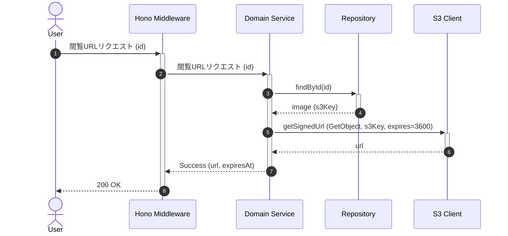

# 画像閲覧用URL取得

## ID

api004-upload

## エンドポイント

| メソッド | パス |
|:---|:---|
| GET | `/images/:id` |

## 概要

指定した画像IDに対応する閲覧用Presigned URLを取得する。

## リクエスト

### パスパラメータ

| 物理名 | 論理名 | 型 | 必須 | 説明 |
|:---|:---|:---|:---:|:---|
| id | 画像ID | string (UUID) | ✓ | 閲覧したい画像のID |

## レスポンス

### 200 OK

| 物理名 | 論理名 | 型 | 必須 | 説明 |
|:---|:---|:---|:---:|:---|
| url | 閲覧用URL | string | ✓ | 画像の閲覧用Presigned URL |
| expiresAt | 有効期限 | string | ✓ | URLの有効期限（ISO-8601形式） |

```json
{
  "url": "string",
  "expiresAt": "iso-8601"
}
```

### ステータスコード

| コード | 説明 |
|:---|:---|
| 200 | 成功 |
| 404 | 指定IDの画像が存在しない |

## 内部処理シーケンス



## 懸案事項

### アクセス権限の未実装
- **現状**: 画像IDさえ知っていれば誰でも閲覧可能
- **影響**: 他ユーザーのプライベート画像にアクセス可能になる
- **対応方針**: 画像所有者のみアクセス許可の認可チェック

## TBD

### アクセス制御の細粒度化
- 画像ごとの公開・非公開設定
- 特定ユーザーへのアクセス許可機能
- 一時的なアクセスURL発行

### キャッシュ戦略
- CloudFrontによるCDNキャッシュ
- 閲覧URLのキャッシュ期間最適化
- 画像の最適化（リサイズ）とキャッシュ
