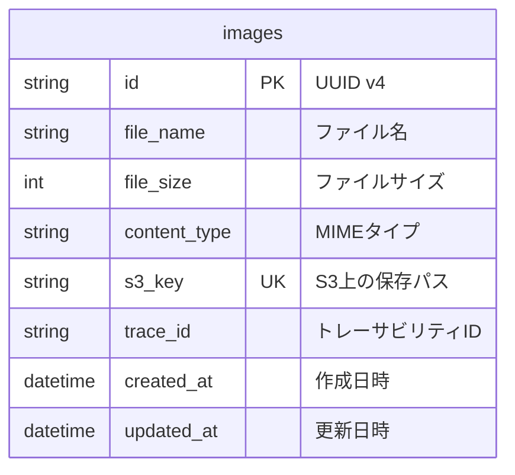

# ER図

## 関連ドキュメント

- [テーブル定義書]()
- [req001-upload]()

## ER図

```mermaid
erDiagram
    images {
        string id PK "UUID v4"
        string file_name "ファイル名"
        int file_size "ファイルサイズ"
        string content_type "MIMEタイプ"
        string s3_key UK "S3上の保存パス"
        string trace_id "トレーサビリティID"
        datetime created_at "作成日時"
        datetime updated_at "更新日時"
    }
```
