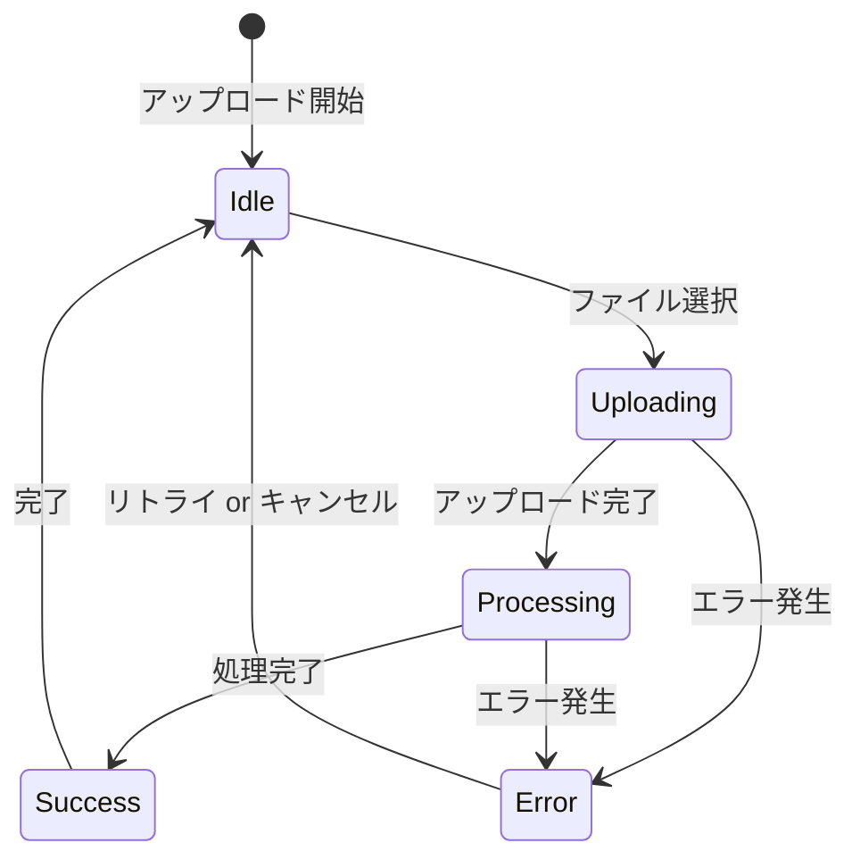

# 画面共通仕様

## トレーサビリティ

### 使い分け

| ID | 目的 | 生成場所 | 有効期間 | 主な用途 |
|:---|:---|:---|:---|:---|
| **trace_id** | **横断的トレーサビリティ** | Frontend (セッション開始時) | セッション全体 | ログ集約・障害調査 |
| **request_id** | **操作的冪等性** | Frontend (各操作開始時) | 単一操作 | 重複実行防止・キャンセル |

### trace_id の生成と伝播

- **用途**: ユーザーセッション全体の追跡、横断的なログ検索
- **生成**: アプリ初期化時に UUID v4 を一度だけ生成し、グローバル状態で保持
- **伝播**: 全APIリクエストヘッダー `X-Trace-ID` に自動付与
- **可視化**: 開発者ツールで表示し、障害調査時に CloudWatch Logs Insights で横断検索

### request_id の生成と管理

- **用途**: 操作の重複防止、非同期処理のキャンセル、リトライ制御
- **生成**: 各操作開始時に UUID v4 を都度生成（ファイルアップロード、API呼び出しなど）
- **管理**: 操作単位でローカルに管理し、処理完了まで保持
- **冪等性**: 同一操作の重複実行を防止するため、request_id を生成して管理
- **キャンセル対応**: 非同期処理のキャンセル時に request_id を使用して処理を特定

## プログレスバー

### アップロードプログレスバー

### プログレスバーの仕様

- **表示条件**: ファイルアップロード時、API リクエスト時
- **進捗表示**: パーセンテージと残り時間を表示
- **キャンセル機能**: ユーザーがいつでもキャンセル可能
- **エラー表示**: エラー発生時に詳細メッセージを表示

## 懸案事項

### 技術的懸案

- **ブラウザ互換性**: AbortController の IE サポート
- **ネットワーク切断**: オフライン時の処理方針

### UI/UX 懸案

- **エラーメッセージ**: ユーザーフレンドリーなエラー表現
- **アクセシビリティ**: スクリーンリーダー対応

## TBD

### 機能仕様

- [ ] **ファイルサイズ制限**: 具体的な上限値の決定
- [ ] **同時アップロード数**: 複数ファイル同時アップロードの制限
- [ ] **プレビュー機能**: アップロード前の画像プレビュー要否

### 技術仕様

- [ ] **CDN 対応**: 静的アセットの配信戦略
- [ ] **PWA 対応**: Service Worker の導入要否
- [ ] **監視体制**: エラーログ収集方法

### セキュリティ仕様

- [ ] **CSP ポリシー**: Content Security Policy の詳細
- [ ] **XSS 対策**: 入力値検証の範囲
- [ ] **CSRF 対策**: トークン管理方式

### 非同期処理の制御

- [ ] **キャンセル機構**
  - アップロード実行中のキャンセル機能
  - 実装方式: AbortController or XMLHttpRequest.abort()
  - キャンセル後の状態: S3のアップロード中断、DB登録スキップ

- [ ] **リトライ機構**
  - ネットワークエラー時の自動リトライ
  - リトライ回数: 2-3回（検討中）
  - リトライ間隔: 指数バックオフ（検討中）
  - 対象エラー: 一時的なネットワーク障害のみ

### エラーハンドリングの詳細化

- [ ] **エラーメッセージの粒度**
  - 現状: 通信エラー/サーバーエラーの大分類
  - 要件: タイムアウト、権限エラー、容量超過など詳細な分類
  - 影響: メッセージ一覧表の拡張必要

- [ ] **オフライン対応**
  - ネットワーク接続状況の検出
  - オフライン時のUI挙動（ボタンDisabled、メッセージ表示）
  - オンライン復帰時の自動再送信
