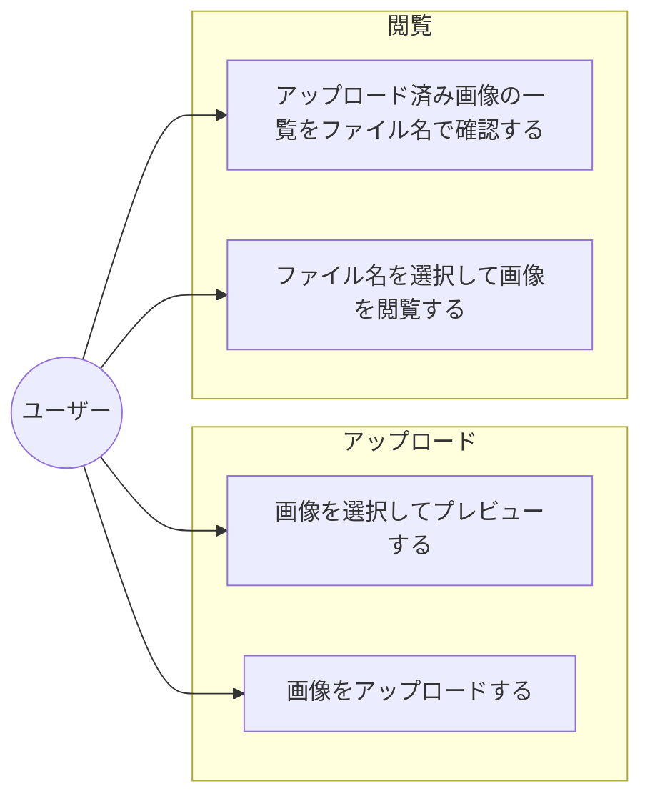
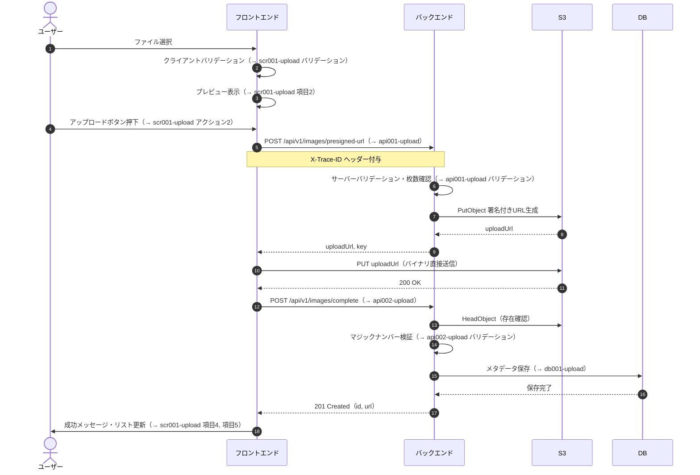
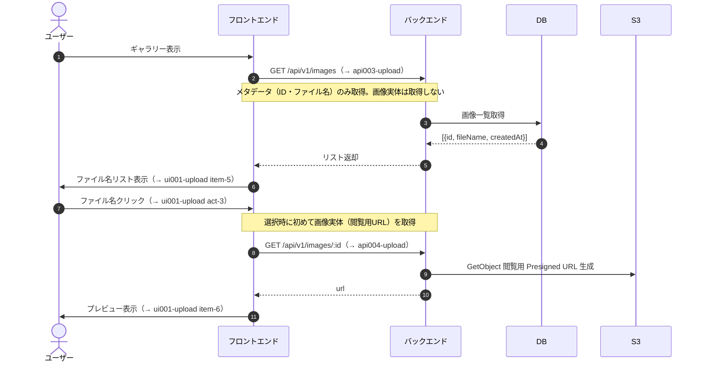

# 画像アップロード機能

## ID

ia001-upload

## 関連仕様・設計

| 種別 | ドキュメント |
|---|---|
| 要件 | [req001-upload](/requirements/req001-upload/) |
| UI | [scr001-upload](/ui/scr001-upload/) |
| API | [api001-upload](/api/images/api001-upload/) |
| API | [api002-upload](/api/images/api002-upload/) |
| API | [api003-upload](/api/images/api003-upload/) |
| API | [api004-upload](/api/images/api004-upload/) |
| インフラ | [infra001-upload](/infra/infra001-upload/) |
| セキュリティ | [sec001-upload](/security/sec001-upload/) |

---

## ユースケース図

---

## シーケンス: 画像アップロード

---

## シーケンス: 画像閲覧

---

## エラーフロー

| 発生箇所 | 条件 | 挙動 |
|---|---|---|
| クライアントバリデーション | サイズ超過・形式違反 | リクエスト送信せずエラー表示（→ ui001-upload） |
| Presigned URL 発行 | 枚数上限・レート超過 | 409 / 429 を受けてエラー表示（→ api001-upload） |
| S3 PUT | 有効期限切れ | Presigned URL 発行から再試行 |
| S3 PUT / API呼び出し | ネットワークエラー | アップロードを中断し、item-4 に再試行を促すメッセージを表示 |
| マジックナンバー検証失敗 | バイナリ不一致 | S3ファイル削除・422 返却（→ api002-upload） |
